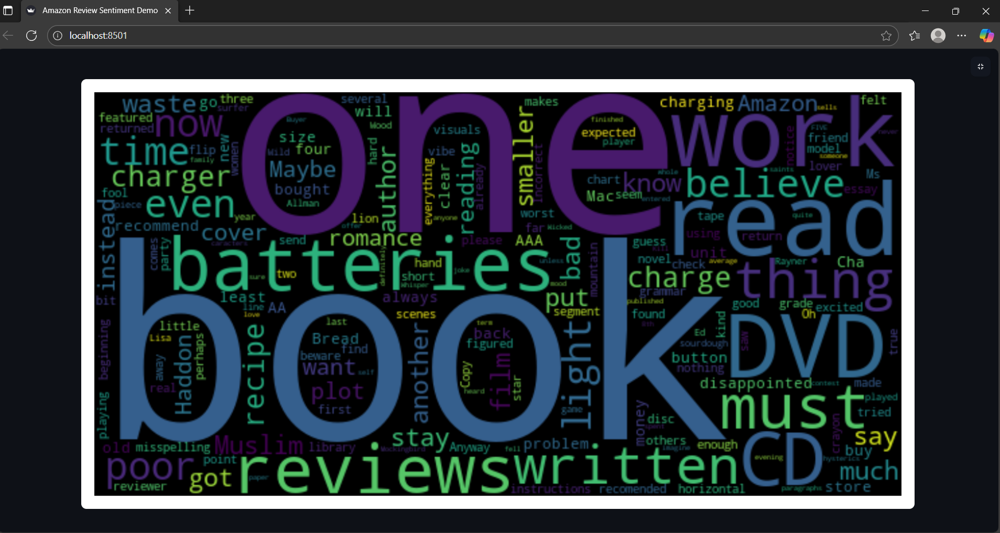

# Amazon-review-sentiment-analysis

## Summary:

Amazon Review Sentiment Analysis is a machine learning project that classifies Amazon product reviews as positive or negative using NLP techniques. It includes data preprocessing, a Logistic Regression model, and an interactive Streamlit web app with visualizations like word clouds and sentiment distributions.

## Features:

1. Sentiment classification (Positive/Negative)
2. Data preprocessing with NLP
3. Logistic Regression model
4. Streamlit web app with live predictions
5. Visualizations: word clouds, sentiment distribution

## Installation & Setup

```bash
# Clone repo
git clone <repo-url>
cd <repo-folder-name>

# Install dependencies
pip install -r requirements.txt

# Run Streamlit app
python -m streamlit run app.py
```
## Demo *(Workflow)*

### Streamlit App  
  

### Single review prediction  
  
  

### Bulk review prediction  
 
 
 
 
 

### Product specific sentiment analysis

 
 
